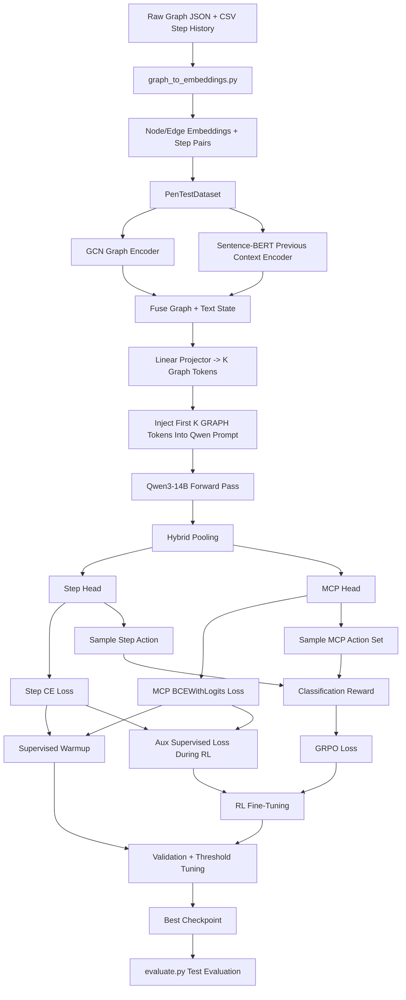

# StepModel: Current Architecture and End-to-End Pipeline

## 1. Overview

This document explains the **current** `Research/stepmodel` pipeline from start to end.

The current system is a **classification pipeline** for predicting:

1. the **next Step** label from a fixed set of 10 classes
2. the **next MCP tool set** from a fixed set of 11 tool labels

It is no longer a free-text generation system for training and reward.
It now uses:

- **GCN** for graph encoding
- **Sentence-BERT** for previous text context
- **Qwen3-14B + LoRA** as the LLM backbone
- **multi-graph-token injection** into `[GRAPH]` placeholders
- **supervised warmup + GRPO fine-tuning with auxiliary supervised anchoring**

---

## 2. High-Level Goal

Given the current pentest state:

- penetration-testing graph
- previous strategy
- previous step
- previous result
- previous MCP tasks

the model predicts:

- the **next Step**
- the **next MCP tools**

---

## 3. Label Space

The model uses a fixed ontology defined in `label_space.py`.

### Step labels
There are **10 Step classes**.

### MCP labels
There are **11 MCP tool labels**.

The Step task is:

- **single-label classification**

The MCP task is:

- **multi-label classification**

---

## 4. Data Preparation

Data preparation happens in `graph_to_embeddings.py`.

### Input sources

- processed graph JSON files
- CSV files containing step histories

### What happens

For each machine:

1. graph JSON is loaded
2. node text is created from node fields such as:
   - type
   - label
   - title
3. edge text is created from:
   - edge type / label
   - source node text
   - target node text
4. Sentence-BERT embeds nodes and edges
5. CSV rows are converted into sequential `previous -> next` step pairs

### Output

Each processed machine produces:

- `nodes`
- `edges`
- `step_pairs`

---

## 5. Training Sample Structure

Each training sample contains:

- graph nodes
- graph edges
- previous text context
- prompt text with repeated `[GRAPH]` placeholders
- gold Step label
- gold MCP multi-hot vector

Unknown or invalid Step labels are filtered out during dataset preparation.

---

## 6. Current Architecture

The model has four main components:

1. **Graph encoder**
2. **Text encoder**
3. **Fusion + graph-token projector**
4. **LLM + classifier heads**

---

## 7. Graph Encoder

The graph encoder is now **GCN**.

### Input

- node embeddings
- edge connectivity

### Output

- a graph-state embedding

### Important point

The current code uses a 2-layer graph convolutional network over node embeddings, then pools to a graph-state representation before token projection.

The graph stream still follows the same broad idea:

- learn a graph representation
- turn it into graph tokens for the LLM

---

## 8. Text Encoder

The text encoder is:

- **Sentence-BERT**
- model: `all-MiniLM-L6-v2`

It encodes the previous pentest text context into one dense embedding.

This context includes compact fields such as:

- strategy
- step
- result
- MCP tasks

---

## 9. Fusion Layer

The graph embedding and previous-text embedding are fused together.

Conceptually:

$$
h_{\text{fused}} = f_{\text{combine}}([h_{\text{graph}} ; h_{\text{text}}])
$$

where:

- $ h_{\text{graph}} $ = graph embedding from GCN
- $ h_{\text{text}} $ = Sentence-BERT context embedding
- `[ ; ]` = concatenation

---

## 10. Graph Token Projection

After fusion, the model uses a **linear projector** to map the fused state into **K graph tokens**.

Conceptually:

$$
H_{\text{graph-tokens}} = W h_{\text{fused}} + b
$$

Then reshaped as:

$$
H_{\text{graph-tokens}} \in \mathbb{R}^{K \times d_{\text{llm}}}
$$

where:

- $K$ = number of graph tokens
- $d_{\text{llm}}$ = LLM hidden size

### Current meaning

Instead of injecting just one graph vector into one token slot, the model now injects **multiple graph tokens**.

This is closer to the paper idea.

---

## 11. Prompt Construction

Prompt text is built from previous pentest context.

At the beginning of the prompt, the system inserts repeated `[GRAPH]` placeholders.

Example conceptually:

```text
[GRAPH] [GRAPH] [GRAPH] [GRAPH]
### Previous Penetration Testing Context ###
Strategy: ...
Step: ...
Result: ...
MCP Tasks: ...

### Prediction Task ###
Predict the next Step label and the MCP tool labels from the fixed ontology.
```

---

## 12. Graph Token Injection Into Qwen

The tokenizer converts the prompt into token IDs.

Then:

1. input embeddings are obtained from the Qwen embedding layer
2. the first `K` `[GRAPH]` token embeddings are replaced by the projected graph tokens

So the graph is not given as plain text.
It is given as **learned token embeddings**.

This is one of the most important architectural changes.

---

## 13. LLM Backbone

The LLM backbone is:

- **Qwen/Qwen3-14B**

Training setup currently uses:

- **LoRA**
- optional **4-bit quantization**
- `trust_remote_code=true`

The LLM processes:

- graph-token-injected prompt embeddings
- current pentest context text

---

## 14. Readout / Pooling

After the LLM forward pass, the final hidden states are pooled.

Current default is **hybrid pooling**:

- first token hidden state
- mean pooled hidden state

Conceptually:

$$
h_{\text{pool}} = f_{\text{hybrid}}([h_{\text{first}} ; h_{\text{mean}}])
$$

This is more expressive than using only mean pooling.

---

## 15. Output Heads

The pooled representation is passed to two classifier heads.

### Step head
Predicts:

- one of 10 Step classes

Output:

$$
z_{\text{step}} \in \mathbb{R}^{10}
$$

### MCP head
Predicts:

- 11 MCP tool logits

Output:

$$
z_{\text{mcp}} \in \mathbb{R}^{11}
$$

---

## 16. Phase 1: Supervised Warmup

Phase 1 teaches the model direct label prediction before RL.

### Step loss

$$
L_{\text{step}} = \text{CrossEntropy}(z_{\text{step}}, y_{\text{step}})
$$

### MCP loss

$$
L_{\text{mcp}} = \text{BCEWithLogits}(z_{\text{mcp}}, y_{\text{mcp}})
$$

### Total supervised loss

Current configuration:

$$
L_{\text{sup}} = 1.5 \cdot L_{\text{step}} + 1.5 \cdot L_{\text{mcp}}
$$

### Why this phase exists

Supervised warmup gives the model a stable starting point by teaching:

- the Step label space
- the MCP label space
- how graph + context map to the correct labels

---

## 17. Training Stabilizers in Phase 1

The current code includes several improvements:

- compact prompt style
- Step class weighting
- weighted sampler for Step imbalance
- gradient clipping
- AMP safety handling
- non-finite tensor sanitization

These are meant to stabilize training and improve Step prediction.

---

## 18. Phase 2: GRPO Fine-Tuning

After supervised warmup, the model is fine-tuned with GRPO.

This is now **label-action RL**, not free-text RL.
Unlike the earlier pure-RL phase, the current code also keeps a small supervised anchor active during RL.

---

## 19. What One Rollout Means Now

For one sample:

1. compute Step logits
2. compute MCP logits
3. sample Step from a categorical distribution
4. sample MCP tools from Bernoulli probabilities

So a rollout contains:

- one sampled Step label
- one sampled MCP tool set

---

## 20. Reward Function

The reward is label-based and task-aligned.

Current reward:

$$
R =
0.45 \cdot \text{StepExact}
+ 0.20 \cdot \text{MCPF1}
+ 0.10 \cdot \text{MCPRecall}
+ 0.10 \cdot (\text{StepExact} \cdot \text{MCPF1})
+ 0.15 \cdot \text{BothExact}
$$

### Meaning of terms

- `StepExact` = 1 if Step is exactly correct, else 0
- `MCPF1` = set-level F1 for MCP tools
- `MCPRecall` = recall over gold MCP tools
- `BothExact` = 1 only if both Step and MCP set are exactly correct

This reward is designed so that Step quality remains the dominant signal.

---

## 21. GRPO Advantage Computation

For a group of sampled rollouts:

$$
A_j = \frac{R_j - \overline{R}}{\text{std}(R) + \epsilon}
$$

where:

- $R_j$ = reward of rollout $j$
- $\overline{R}$ = batch mean reward

Interpretation:

- above-average actions get positive advantage
- below-average actions get negative advantage

---

## 22. GRPO Loss

For each rollout:

$$
r_j = \exp(\log p_{\text{new}} - \log p_{\text{old}})
$$

Then clipped GRPO loss:

$$
L_{\text{GRPO}} =
-\frac{1}{M}\sum_j \min(r_j A_j,\ \text{clip}(r_j, 1-\epsilon, 1+\epsilon)A_j)
$$

This encourages the model to increase probability of better-than-average label actions while preventing unstable updates.

### Auxiliary supervised loss during RL

During Phase 2, the code also computes the same supervised label loss used in Phase 1:

$$
L_{\text{sup}} = 1.5 \cdot L_{\text{step}} + 1.5 \cdot L_{\text{mcp}}
$$

and combines it with GRPO:

$$
L_{\text{total}} = L_{\text{GRPO}} + \alpha L_{\text{sup}}
$$

where the current configuration uses:

$$
\alpha = 0.1
$$

This auxiliary supervised term helps keep the model anchored to the gold Step/MCP labels during RL instead of drifting too far toward reward-only behavior.

---

## 23. Validation and Checkpoint Selection

After each epoch:

- validation metrics are computed
- MCP threshold is tuned
- best checkpoint is selected with Step-focused weighting

Metrics include:

- Average Reward
- Step Accuracy
- Step Micro F1
- MCP Accuracy
- MCP Micro F1

---

## 24. Evaluation

Evaluation is performed in `evaluate.py`.

The script:

1. loads a compatible checkpoint
2. rebuilds the model with matching metadata
3. restores:
   - pooling strategy
   - prompt style
   - GNN type
   - graph token count
4. evaluates on the test set

### Final outputs

- Average Reward
- Step Accuracy
- Step Micro F1
- MCP Accuracy
- MCP Micro F1

---

## 25. How The Current System Differs From The Older Version

Older setup:

- closer to free-text generation
- single `[GRAPH]` token replacement
- GPT-style path
- more answer-parsing logic

Current setup:

- direct classification
- GCN graph path
- multiple graph tokens
- Qwen3-14B + LoRA
- label-only reward
- Step/MCP classifier heads
- auxiliary supervised loss during RL

---

## 26. How The Current System Differs From The Paper

The current system is now closer to the paper in these ways:

- uses graph embeddings as token-like inputs to the LLM
- uses a linear projector from graph representation to graph-token space
- uses a GNN graph encoder
- injects multiple graph tokens

But it is still different in important ways:

- your task is **classification**, not zero-shot node/link prediction
- your graph representation is **whole pentest state**, not a central-node representation
- the paper includes a dedicated **self-supervised alignment pretraining** stage
- the paper keeps the LLM frozen, while your current code trains LoRA adapters

So the current system is **paper-inspired and partially aligned**, but not yet a full TEA-GLM reproduction.

---

## 27. Mermaid Flowchart



---

## 28. Plain-Language Summary

The model works like this:

1. build a graph of the current pentest state
2. encode that graph with GCN
3. encode the previous text context with Sentence-BERT
4. combine both into one graph-conditioned representation
5. turn that representation into multiple graph tokens
6. insert those graph tokens into the Qwen input
7. let Qwen reason over the current state
8. directly predict:
   - the next Step label
   - the MCP tools

Then training happens in two stages:

- first supervised learning teaches the labels directly
- then GRPO fine-tunes the label decisions using a reward based on exact Step and MCP correctness while keeping a small supervised loss active

---

## 29. Final One-Line Summary

The current `stepmodel` is a **GCN + Sentence-BERT + Qwen3-14B classification system** that injects the current graph state as **multiple graph tokens** into the LLM, then predicts the next **Step** and **MCP tools** using **supervised warmup followed by GRPO fine-tuning with a small auxiliary supervised anchor**.
