# StepModel-Final-v2: Comprehensive Documentation

## Table of Contents
1. [Overview](#overview)
2. [Architecture](#architecture)
3. [Data Pipeline](#data-pipeline)
4. [Module Details](#module-details)
5. [Training Stages](#training-stages)
6. [Evaluation](#evaluation)
7. [Installation](#installation)
8. [Usage](#usage)
9. [Key Improvements in v2](#key-improvements-in-v2)
10. [Performance Metrics](#performance-metrics)

---

## Overview

StepModel-Final-v2 is a three-stage machine learning pipeline for predicting penetration testing steps. The system processes Penetration Testing Trees (PTT) - textual representations of penetration testing scenarios - and converts them into structured attack graphs. It then predicts the next step type, required MCP (Model Context Protocol) tools, and generates step explanations.

### Key Components

- **Stage 1 (GNN)**: Graph Neural Network for step classification and MCP tool prediction
- **Stage 2 (LLM SFT)**: Supervised fine-tuning of Qwen LLM with graph conditioning
- **Stage 3 (RL)**: GRPO (Group Relative Policy Optimization) reinforcement learning for explanation quality improvement

### Label Spaces

**Step Labels (10 classes)**:
1. Do a google search for more information
2. Enumerate further on the X service to find software versions, hidden directories and file
3. Explore the suspicious files, commands and create a summary of the findings
4. Further Enumerate the website. - hidden directories, links and software
5. Enumerate the domain
6. Exploit the selected exploitations
7. Analyze the outcomes of the previous step and find an attack path
8. Ask for human assistant
9. Explore the source code for vulnerabilities
10. End task and ask permission to generate the report

**MCP Labels (11 tools)**:
- Nmap, Metasploit, Netcat, Dirbuster, SQLmap
- Smb client, hydra, John-the-ripper
- Google search, Interactive CLI, Web page interaction

---

## Architecture

### High-Level Pipeline

```mermaid
flowchart LR
 subgraph Prep["Data Preparation"]
        CSV["training_data.csv<br>test_data.csv<br>Columns: machine, PTT cell,<br>new_strategy, strategy_explanation,<br>gold_new_step, gold_step_explanation,<br>gold_mcp_tasks"]
        PTT["ptt_parser.py<br>parse_ptt()<br>classify()<br>Output: items with<br>number, title, status,<br>payload, depth, type"]
        Graph["graph_builder.py<br>build_graph_from_items()<br>Output: graph JSON with<br>nodes, edges, statistics"]
        JSON["build_input_json.py<br>input/train.json<br>input/test.json<br>Each record:<br>- machine<br>- graph<br>- new_strategy<br>- strategy_explanation<br>- gold_new_step<br>- gold_step_explanation<br>- gold_mcp_tasks"]
  end
 subgraph Stage1["Stage 1: GNN Training<br>stage1_gnn_train.py"]
        S1In["Input: train.json<br>Stage1Dataset loads:<br>- graph<br>- field_embs<br>- step_idx<br>- mcp_vec"]
        S1Train["Training Loop:<br>- GraphEncoder: GATv2<br>- ContextTextProjector<br>- Cross-attention fusion<br>- Step head (10-way)<br>- MCP head (11-way)<br>- Focal loss + class weights"]
        S1Val["Validation:<br>- Step accuracy<br>- MCP micro F1<br>- Combined score<br>- Early stopping"]
        S1Post["Post-Training:<br>- SWA averaging<br>- Per-class MCP threshold<br>  optimization on val set"]
        S1Out["Output:<br>checkpoints/stage1_gnn.pt<br>Contains:<br>- model_state_dict<br>- mcp_thresholds<br>- best_epoch<br>- best_score"]
  end
 subgraph Stage2["Stage 2: LLM SFT<br>stage2_sft_qwen.py"]
        S2In["Input: train.json<br>+ Stage 1 checkpoint<br>SFTDataset loads:<br>- graph<br>- context<br>- step_idx<br>- mcp_labels<br>- gold_step_explanation"]
        S2Stage1["Load Frozen Stage 1:<br>stage1.encode_and_predict()<br>Output: combined_emb<br>(graph + context fusion)"]
        S2Adapter["GraphPrefixAdapter:<br>combined_emb →<br>8 soft-prompt tokens<br>Parameters: graph_dim →<br>llm_hidden"]
        S2LLM["Qwen/Qwen3-14B<br>+ LoRA r=16, alpha=32<br>Input: prefix_embeds +<br>tokenized prompt"]
        S2Train["Training:<br>- Teacher-forced loss<br>- 50% hint masking<br>- Step field accuracy<br>- Gradient accum=4"]
        S2Val["Validation:<br>Greedy decode on val set<br>Step field accuracy"]
        S2Out["Output:<br>checkpoints/stage2_qwen_lora/<br>- LoRA adapter<br>- graph_adapter.pt"]
  end
 subgraph Stage3["Stage 3: GRPO RL<br>stage3_grpo_rl.py"]
        S3In["Input: train.json<br>+ Stage 2 adapter"]
        S3Policy["Policy Model:<br>Stage 2 LoRA trainable<br>+ GraphPrefixAdapter trainable"]
        S3Ref["Reference Model:<br>Stage 2 LoRA frozen<br>+ GraphPrefixAdapter frozen"]
        S3Gen["Generation:<br>G=4 completions per example<br>Greedy decode"]
        S3Reward["Reward Function:<br>- Format correctness<br>- Step similarity<br>- MCP F1 (rarity-weighted)<br>- Explanation LLM judge<br>Curriculum schedule"]
        S3Judge["LLM Judge:<br>Qwen2.5-7B-Instruct<br>Separate from training base<br>Caching enabled"]
        S3RL["GRPO Update:<br>- Group-relative advantages<br>- KL penalty β=0.02<br>- PPO clip ε=0.2"]
        S3Val["Validation:<br>Greedy decode on val set<br>Fixed reward weights<br>Select best checkpoint"]
        S3Out["Output:<br>checkpoints/stage3_qwen_grpo/<br>- LoRA adapter<br>- graph_adapter.pt"]
  end
 subgraph Eval["Evaluation<br>evaluate.py"]
        EvalIn["Input: test.json"]
        EvalGNN["GNN Eval:<br>Load Stage 1 checkpoint<br>Predict on test set<br>Output: step_preds,<br>mcp_preds<br>Metrics: accuracy, F1"]
        EvalLLM["LLM Eval:<br>Load Stage 2/3 adapter<br>+ frozen Stage 1<br>+ GraphPrefixAdapter<br>Generate completions<br>Parse JSON output<br>Output: step, MCP,<br>explanation<br>Metrics: + LLM judge"]
        EvalJudge["LLM Judge:<br>Load separate model<br>Qwen2.5-7B-Instruct<br>Evaluate explanations<br>Rubric: relevance,<br>accuracy, completeness,<br>clarity"]
        EvalCSV["Output CSVs:<br>output/stage1.csv<br>output/stage2.csv<br>output/stage3.csv"]
  end
 subgraph Baseline["Baseline Evaluation<br>baseline_llm_eval.py"]
        BaseIn["Input: test.json<br>+ train.json for few-shot"]
        BaseZero["Zero-shot:<br>No examples<br>Direct LLM query"]
        BaseFew["Few-shot:<br>N examples from train<br>Diverse, size-capped<br>ChatML format"]
        BaseGen["Generation:<br>Qwen/Qwen3-14B<br>Greedy decode"]
        BaseParse["Parse Response:<br>Robust JSON parsing<br>Regex fallbacks<br>Step normalization"]
        BaseCSV["Output CSVs:<br>output/baseline_zeroshot.csv<br>output/baseline_3shot.csv<br>output/baseline_5shot.csv"]
  end
 subgraph Compare["Comparison Report<br>comparison_report.py"]
        CompIn["Input CSVs:<br>stage1.csv, stage2.csv,<br>stage3.csv<br>baseline_*.csv"]
        CompMetrics["Calculate Metrics:<br>- Step: accuracy, macro F1<br>- MCP: micro F1, macro F1<br>- Jaccard similarity"]
        CompTable["Metrics Table:<br>output/metrics_comparison.csv"]
        CompViz["Visualizations:<br>step_comparison.png<br>mcp_comparison.png<br>radar_comparison.png"]
        CompConsol["Consolidated CSV:<br>output/consolidated_predictions.csv"]
        CompReport["Summary Report:<br>output/comparison_report.txt<br>Key improvements"]
  end
    CSV --> PTT
    PTT --> Graph
    Graph --> JSON
    S1In --> S1Train
    S1Train --> S1Val
    S1Val --> S1Post
    S1Post --> S1Out
    S2In --> S2Stage1
    S2Stage1 --> S2Adapter
    S2Adapter --> S2LLM
    S2LLM --> S2Train
    S2Train --> S2Val
    S2Val --> S2Out
    S3In --> S3Policy & S3Ref
    S3Policy --> S3Gen
    S3Gen --> S3Reward
    S3Reward --> S3Judge
    S3Judge --> S3RL
    S3Ref --> S3RL
    S3RL --> S3Val
    S3Val --> S3Out
    EvalIn --> EvalGNN & EvalLLM
    EvalLLM --> EvalJudge & EvalCSV
    EvalGNN --> EvalCSV
    BaseIn --> BaseZero & BaseFew
    BaseZero --> BaseGen
    BaseFew --> BaseGen
    BaseGen --> BaseParse
    BaseParse --> BaseCSV
    CompIn --> CompMetrics & CompConsol
    CompMetrics --> CompTable & CompViz & CompReport
    JSON --> S1In & EvalIn & BaseIn
    S1Out --> S2In & EvalIn
    S2Out --> S3In & EvalIn
    S3Out --> EvalIn
    EvalCSV --> CompIn
    BaseCSV --> CompIn

     CSV:::prep
     PTT:::prep
     Graph:::prep
     JSON:::prep
     S1In:::stage1style
     S1Train:::stage1style
     S1Val:::stage1style
     S1Post:::stage1style
     S1Out:::stage1style
     S2In:::stage2style
     S2Stage1:::stage2style
     S2Adapter:::stage2style
     S2LLM:::stage2style
     S2Train:::stage2style
     S2Val:::stage2style
     S2Out:::stage2style
     S3In:::stage3style
     S3Policy:::stage3style
     S3Ref:::stage3style
     S3Gen:::stage3style
     S3Reward:::stage3style
     S3Judge:::stage3style
     S3RL:::stage3style
     S3Val:::stage3style
     S3Out:::stage3style
     EvalIn:::eval
     EvalGNN:::eval
     EvalLLM:::eval
     EvalJudge:::eval
     EvalCSV:::eval
     BaseIn:::base
     BaseZero:::base
     BaseFew:::base
     BaseGen:::base
     BaseParse:::base
     BaseCSV:::base
     CompIn:::comp
     CompMetrics:::comp
     CompTable:::comp
     CompViz:::comp
     CompConsol:::comp
     CompReport:::comp
    classDef prep fill:#e1f5ff,stroke:#01579b,stroke-width:2px
    classDef stage1style fill:#fff3e0,stroke:#e65100,stroke-width:2px
    classDef stage2style fill:#f3e5f5,stroke:#7b1fa2,stroke-width:2px
    classDef stage3style fill:#e8f5e9,stroke:#2e7d32,stroke-width:2px
    classDef eval fill:#fce4ec,stroke:#c2185b,stroke-width:2px
    classDef base fill:#fff9c4,stroke:#f57f17,stroke-width:2px
    classDef comp fill:#e0f2f1,stroke:#00695c,stroke-width:2px
```



### Graph Schema

**Node Types**:
- **State (Blue)**: Pentest phase/sub-phase or informational items (target IP, hostname, OS, etc.)
- **Action (Orange)**: Concrete actions performed by the pentester
- **Finding (Green)**: Results produced by actions

**Edge Types**:
- **StateTransition (Black)**: State → State (advancing through PTT)
- **SearchUpdate (Green)**: State → Action (starting work on PTT item)
- **TrackUpdate (Blue)**: Action → Finding (execution produced findings)
- **Prediction (Purple)**: Finding → State (findings lead back to state)

**Status Shading**:
- Dark: completed
- Mid: in_progress
- Light: to_do

---

## Data Pipeline

### 1. PTT Parsing (`data_prep/ptt_parser.py`)

The deterministic rule engine converts free-text PTT cells into structured graph representations.

**Key Features**:
- Line-by-line parsing using numbered item boundaries
- Brace-balance scanning for multi-line payloads
- Bare data block merging (e.g., "1.3.2.1 {...}" merged into parent "1.3.2")
- Machine name validation to filter corrupted rows

**Classification Rules** (in order of precedence):
1. Top-level items (depth=0) → State
2. No payload → State
3. Identity/location labels (Target IP, hostname, OS, etc.) → State
4. Title opens with action verb (Perform, Enumerate, Exploit, etc.) → Action
5. Title ends in reporting noun (Status, Headers, Certificate, etc.) → State
6. Default → State (conservative)

**Validation**:
- Identity/location fields are NEVER classified as Action (hard rule)
- Ambiguous items are flagged for LLM adjudication in hybrid mode

### 2. Graph Building (`data_prep/graph_builder.py`)

Deterministic assembly of classified items into vis-network compatible graphs.

**Key Functions**:
- `build_graph_from_items()`: Converts classified item list to graph JSON
- `validate_row_graph()`: Structural and hard-rule validation
  - Every item produces exactly one node
  - Action with payload has exactly one Finding node
  - Identity/location titles never classified as Action
  - Statistics consistency checks

### 3. Input JSON Generation (`data_prep/build_input_json.py`)

Builds `input/train.json` and `input/test.json` with the following schema:

```json
{
  "machine": "...",
  "graph": <attack graph JSON>,
  "new_strategy": "...",
  "strategy_explanation": "...",
  "gold_new_step": "...",
  "gold_step_explanation": "...",
  "gold_mcp_tasks": "..."
}
```

**Modes**:
- `--mode rule`: Deterministic parsing (default, no API key needed)
- `--mode llm`: LLM-based parsing from scratch
- `--mode hybrid`: Deterministic structure + LLM classifies ambiguous items only

**Data Leakage Prevention**:
- Machine-level train/validation/test splitting
- No machine appears in multiple splits
- Title embedding cache cleared for test data

---

## Module Details

### Core Module (`core/`)

#### config.py
Central configuration file defining:
- Label spaces (`STEP_LABELS`, `MCP_LABELS`)
- File paths (data, input, checkpoints)
- Hyperparameters for all stages
- Model names and dimensions

**Key Constants**:
- `TEXT_ENCODER_NAME`: "BAAI/bge-base-en-v1.5" (768-dim embeddings)
- `QWEN_MODEL_NAME`: "Qwen/Qwen3-14B" (SFT)
- `LLM_JUDGE_MODEL_NAME`: "Qwen/Qwen2.5-7B-Instruct" (evaluation)
- `CORRECTNESS_THRESHOLD`: 0.6 (LLM judge)
- `RANDOM_SEED`: 42

#### data_utils.py
Data preprocessing utilities:

**Key Functions**:
- `load_from_input_json()`: Loads and preprocesses JSON data, builds torch_geometric Data objects
- `StepLabelNormalizer`: Normalizes free-text step labels to canonical form
- `extract_mcp_labels()`: Extracts MCP tool names from text (handles dict keys and free text)
- `mcp_multihot()`: Converts MCP labels to multi-hot vectors

**Features**:
- Sentence embedding cache for performance
- Cache cleared for test data to prevent leakage
- Node features: sentence embeddings + one-hot node type + degree
- Edge attributes: semantic edge types

#### graph_encoder.py
Stage 1 model architecture:

**Components**:
1. **GraphEncoder**: GATv2-based GNN with multi-scale pooling
   - Multi-layer GATv2 with edge awareness
   - Enhanced input projection
   - Multiple pooling strategies (mean, max, attentional, Set2Set)

2. **ContextTextProjector**: MLP projecting context embeddings to GNN space

3. **Stage1Classifier**: Fuses graph and context representations
   - Cross-attention fusion (graph ↔ context)
   - Enhanced gating with residual connections
   - Two classification heads: step (single-label) and MCP (multi-label)

**Loss Function**:
- Focal loss for MCP classification (gamma=2.0)
- Label smoothing for step classification
- Class weights for imbalanced data
- Combined loss: `STEP_LOSS_WEIGHT * step_loss + MCP_LOSS_WEIGHT * mcp_loss`

#### llm_judge.py
LLM-based evaluation for step explanations:

**Rubric Dimensions** (0-3 integer scale):
1. **Relevance**: Does explanation justify the same predicted step?
2. **Technical Accuracy**: Are technical claims correct?
3. **Completeness**: Does it cover key reasoning points?
4. **Clarity**: Is it well-structured and unambiguous?

**Correctness Score**: Average of four dimensions (0-1)
**Binary Correctness**: Score ≥ 0.6

**Features**:
- Greedy decoding (no sampling) for reproducibility
- Persistent disk cache (`.llm_judge_cache/`)
- Robust JSON parsing with retry mechanism
- Chat template usage for instruction-tuned models

#### mcp_threshold_search.py
Per-class threshold optimization for MCP multi-label classification:

**Key Functions**:
- `predict_with_per_class_thresholds()`: Applies separate thresholds per MCP label
- `search_per_class_thresholds()`: Grid-search for optimal thresholds
- `validate_thresholds_vs_baseline()`: Safety net against regression

**Anti-Overfitting Measures**:
1. **Min-Support Gate**: Only search thresholds for classes with ≥10 positive examples
2. **Bootstrap-Stabilized Search**: Median of bootstrap resamples
3. **Bounded Range**: Thresholds limited to [0.15, 0.85]
4. **Safety-Net Check**: Revert to 0.5 baseline if tuned thresholds perform worse

---

## Training Stages

### Stage 1: GNN Training (`training/stage1_gnn_train.py`)

**Objective**: Supervised training for step classification and MCP tool prediction

**Dataset**: `input/train.json` with machine-level train/val split

**Training Details**:
- **Optimizer**: AdamW with cosine annealing and warmup
- **Class Weights**: Inverse frequency with rare-class boost (2.5x for MCP, 2.0 for steps)
- **Sampling**: WeightedRandomSampler for rare-class oversampling
- **Loss**: Focal loss for MCP, cross-entropy for steps with class weights
- **Early Stopping**: Patience=12 epochs
- **SWA (Stochastic Weight Averaging)**: Top-3 checkpoint averaging

**Adaptive Cost-Sensitive Loss** (after warmup):
- Adjusts class weights based on per-class accuracy
- Combines frequency-based and performance-based weights
- Beta=0.5 balance between the two

**Selection Objective** (aligned with reported metric):
```
val_score = 0.45 * step_accuracy + 0.45 * mcp_micro_f1 + 0.10 * step_macro_f1
```

**Post-Training**:
- Per-class MCP threshold optimization on validation set
- Test set evaluation with optimized thresholds
- CSV output: `output/stage1.csv`

### Stage 2: LLM SFT (`training/stage2_sft_qwen.py`)

**Objective**: Supervised fine-tuning of Qwen with graph conditioning for step explanation generation

**Architecture**:
- **Base Model**: Qwen/Qwen3-14B with LoRA (r=16, alpha=32)
- **GraphPrefixAdapter**: Projects graph embedding to soft-prompt tokens (16 tokens)
- **Input**: Graph prefix + text prompt → LLM → JSON output

**Graph Conditioning**:
- Uses frozen Stage-1 classifier's fused representation (`FUSION_HIDDEN // 2`)
- Graph prefix tokens prepended to LLM input embeddings
- Critical fix: Uses `stage1.encode_and_predict()` for proper fusion

**Training Details**:
- **Optimizer**: AdamW with cosine schedule and warmup
- **Gradient Accumulation**: 4 steps
- **Batch Size**: 4 (effective = 16 with accumulation)
- **Max Length**: 1536 tokens
- **Hint Masking**: 50% probability during training to force graph learning
- **Validation Metric**: Step field accuracy (token-level exact match on step value span)

**Prompt Structure**:
```
# Context
Machine: {machine}

# Strategy
New strategy: {new_strategy}
Strategy explanation: {strategy_explanation}

# Task
Based on the machine and strategy above, determine the next step...
```

**Target Format**:
```json
{
  "New step": "{step_label}",
  "Step explanation": "{explanation}",
  "MCP_tasks": {
    "{tool}": "Use {tool} as part of: {step}"
  }
}
```

**Data Leakage Prevention**:
- Machine-level train/val split (15% val)
- Overlap check against test set
- Stage-1 hint removed during training (mask_hint=True)

### Stage 3: GRPO RL (`training/stage3_grpo_rl.py`)

**Objective**: Reinforcement learning optimization for explanation quality using GRPO

**Why Custom Loop**: trl.GRPOTrainer doesn't support arbitrary embedding prepends (graph soft-prompts)

**Architecture**:
- **Policy Model**: Stage-2 LoRA (trainable)
- **Reference Model**: Stage-2 LoRA (frozen, for KL penalty)
- **Value Head**: Learned baseline for variance reduction
- **Graph Conditioning**: Same GraphPrefixAdapter as Stage 2

**Reward Function** (curriculum learning):
```
r = w_fmt * format_ok
  + w_step * step_similarity
  + w_mcp * mcp_set_F1
  + w_exp * explanation_score
```

**Curriculum Schedule**:
- **Foundation (0-25%)**: w_fmt=0.25, w_step=0.55, w_mcp=0.15, w_exp=0.05
- **Integration (25-50%)**: Gradual shift to include MCP
- **Refinement (50-100%)**: w_fmt=0.10, w_step=0.25, w_mcp=0.25, w_exp=0.40

**Reward Components**:
1. **Format**: Valid JSON with all 3 required keys
2. **Step**: Exact match + embedding similarity + category bonus
3. **MCP**: Rarity-weighted F1 (inverse-sqrt frequency)
4. **Explanation**: LLM judge score + length/structure/consistency bonuses

**LLM Judge for Explanation**:
- Separate model (Qwen2.5-7B-Instruct) from training base
- Caching mechanism for efficiency
- Fallback heuristics if unavailable

**Training Details**:
- **Group Size**: G=4 completions per example
- **KL Coefficient**: β=0.02
- **PPO Clip**: ε=0.2
- **Steps**: 2000 (configurable)
- **Learning Rate**: 1e-5

**Critical Fix**: Completion slicing bug when generating with `inputs_embeds` only
- Previous: Assumed output included prompt tokens → empty tensor
- Fixed: Treat `gen_out` as completion only, trim trailing pad tokens

**Model Selection**:
- Validation-based checkpoint selection (fixed missing signal in v1)
- Greedy-decode on held-out val set with fixed reward weights
- Selects best checkpoint instead of last step

---

## Evaluation

### evaluate.py

Comprehensive evaluation for all three stages.

**Metrics Reported**:

**Step Classification**:
- Accuracy, Macro-F1, Weighted-F1
- Per-class precision/recall/F1
- Confusion matrix
- Jaccard similarity (exact match ratio)

**MCP Classification** (multi-label):
- Subset (exact-match) accuracy
- Micro-F1, Macro-F1, Samples-F1
- Per-label precision/recall/F1
- Jaccard similarity

**Explanation Quality** (LLM stages only):
- LLM Judge evaluation (correctness score 0-1)
- Binary correctness (≥ 0.6)
- Overall accuracy

**Usage**:
```bash
python evaluate.py --model gnn              # GNN only
python evaluate.py --model llm              # Best LLM adapter
python evaluate.py --model llm --adapter-dir checkpoints/stage3_qwen_grpo
python evaluate.py --save-explanations out.csv
```

**Key Features**:
- Loads separate LLM judge model (different from training base)
- Robust JSON parsing with multiple fallback patterns
- Hint masking during inference (mask_hint=True)
- CSV output with predictions

### baseline_llm_eval.py

Baseline evaluation without graph conditioning or fine-tuning.

**Modes**:
- Zero-shot: Direct LLM query with no examples
- Few-shot: LLM query with N examples (3-shot, 5-shot)

**Prompt Format**: ChatML for Qwen2.5-Instruct
```
<|im_start|>system
{SYSTEM_PROMPT}<|im_end|>
<|im_start|>user
{example_1_query}<|im_end|>
<|im_start|>assistant
{example_1_response}<|im_end|>
...
<|im_start|>user
{test_query}<|im_end|>
<|im_start|>assistant
```

**Few-Shot Selection**:
- Diverse examples from different step groups
- Size-capped to avoid truncation (MAX_EXPL_CHARS=600, MAX_PROMPT_CHARS=1500)
- Medium-length examples preferred

**Output**: `output/baseline_zeroshot.csv`, `output/baseline_3shot.csv`, etc.

### comparison_report.py

Generates comprehensive comparison reports across all models.

**Outputs**:
1. **metrics_comparison.csv**: Consolidated metrics table
2. **step_comparison.png**: Bar chart for step metrics
3. **mcp_comparison.png**: Bar chart for MCP metrics
4. **radar_comparison.png**: Radar chart for overall comparison
5. **consolidated_predictions.csv**: All predictions in one file
6. **comparison_report.txt**: Summary with key improvements

**Models Compared**:
- baseline_zeroshot, baseline_3shot, baseline_5shot
- stage1 (GNN), stage2 (SFT), stage3 (GRPO)

---

## Installation

### Requirements

```bash
pip install torch torchvision torchaudio --index-url https://download.pytorch.org/whl/cu118
pip install torch-geometric
pip install transformers peft
pip install pandas numpy scikit-learn
pip install matplotlib seaborn
pip install openai
pip install tqdm
```

### Model Download

Models are automatically downloaded from HuggingFace on first use:
- `BAAI/bge-base-en-v1.5` (text encoder)
- `Qwen/Qwen3-14B` (SFT base)
- `Qwen/Qwen2.5-7B-Instruct` (LLM judge)

---

## Usage

### Full Pipeline

```bash
# Run all stages
python run.py

# Run from specific stage
python run.py --start-from stage2

# Run specific stages only
python run.py --stages stage1,stage2
```

### Individual Stages

```bash
# Data preparation
python data_prep/generate_graphs.py --mode rule
python data_prep/build_input_json.py --mode rule

# Stage 1: GNN training
python training/stage1_gnn_train.py

# Stage 2: LLM SFT
python training/stage2_sft_qwen.py

# Stage 3: GRPO RL
python training/stage3_grpo_rl.py

# Evaluation
python eval/evaluate.py --model gnn
python eval/evaluate.py --model llm --adapter-dir checkpoints/stage2_qwen_lora

# Baselines
python eval/baseline_llm_eval.py --num_shots 0
python eval/baseline_llm_eval.py --num_shots 3

# Comparison report
python eval/comparison_report.py
```

### LLM-based Parsing (Optional)

```bash
export OPENAI_API_KEY=sk-...
python data_prep/generate_graphs.py --mode llm
python data_prep/build_input_json.py --mode llm
```

---

## Key Improvements in v2

### 1. Repository Restructuring
- Organized into `core/`, `data_prep/`, `training/`, `eval/` directories
- Clear separation of concerns
- All existing scripts remain runnable

### 2. Data Leakage Fixes
- Machine-level train/validation/test splitting
- Title embedding cache cleared for test data
- Overlap checks between splits

### 3. Stage 1 Improvements
- **Selection Objective Alignment**: Changed from `step_macro_f1 + mcp_micro_f1` to weighted combination matching reported metric
- **SWA (Stochastic Weight Averaging)**: Top-3 checkpoint averaging for stability
- **Adaptive Cost-Sensitive Loss**: Dynamic class weight adjustment based on performance
- **Per-class MCP Thresholds**: Robust optimization with anti-overfitting measures

### 4. Stage 2 Improvements
- **Graph Conditioning Fix**: Uses `stage1.encode_and_predict()` for proper fusion (previously used graph_encoder alone)
- **Hint Masking**: 50% probability during training to force graph learning
- **Validation Metric**: Step field accuracy (token-level exact match) instead of blended loss
- **Whole Frozen Stage-1**: Keeps encoders + gates + fusion (previously discarded gates)

### 5. Stage 3 Improvements
- **Completion Slicing Fix**: Correct handling of `inputs_embeds` generation
- **Validation-Based Selection**: Model selection on held-out val set (previously saved last step)
- **Curriculum Learning**: Three-stage reward schedule
- **Value Head**: Learned baseline for variance reduction
- **Separate LLM Judge**: Different model from training base to prevent self-deception

### 6. PTT Parser Improvements
- **Line-by-line parsing**: Handles items without explicit status tokens
- **Brace-balance scanning**: Multi-line payloads supported
- **Bare data block merging**: "1.3.2.1 {...}" merged into parent
- **Classification v3**: Flipped default for payload-bearing items (State unless leading verb)
- **Machine name validation**: Filters corrupted rows

### 7. Evaluation Improvements
- **Separate LLM Judge**: Different model from training base
- **Robust Parsing**: Multiple fallback patterns for JSON extraction
- **Hint Masking**: Forced during inference
- **Comprehensive Metrics**: Jaccard similarity, per-class reports

---

## Performance Metrics

### Target Metrics

**Stage 1 (GNN)**:
- Step Accuracy: ≥ 85%
- MCP Micro F1: ≥ 70%
- Combined Score: ≥ 80%

**Stage 2/3 (LLM)**:
- Step Exact Match: Target improvement over Stage 1
- Explanation Correctness (LLM Judge): ≥ 60%
- MCP F1: Target improvement over Stage 1

### Current Performance

*Note: Actual performance depends on training data and hyperparameters. Run evaluation scripts to get current metrics.*

### Comparison with Baselines

Expected improvements over zero-shot baseline:
- Step classification: +20-30% accuracy
- MCP classification: +15-25% micro F1
- Explanation quality: Significant improvement in semantic correctness

---

## Troubleshooting

### Common Issues

**CUDA Out of Memory**:
- Reduce batch size in config.py
- Use gradient accumulation
- Use smaller model variants

**LLM Judge Fails**:
- Check API key (if using OpenAI)
- Fallback to heuristic evaluation (automatic)
- Ensure model is downloaded

**Graph Parsing Errors**:
- Check PTT text format
- Use `--mode llm` for ambiguous cases
- Review `_validation_report.json`

**Stage 3 Not Improving**:
- Check validation-based selection is working
- Verify curriculum schedule
- Ensure separate LLM judge is loaded

### Debugging

Enable verbose logging:
```bash
python evaluate.py --model llm --verbose
```

Check validation reports:
```bash
cat input/_validation_report_train.json
cat processed_graph/train/_validation_report.json
```

---

## Citation

If you use this code, please cite:
```
StepModel-Final-v2: A Three-Stage Pipeline for Penetration Testing Step Prediction
```

---

## License

Please refer to the LICENSE file in the repository.

---

## Contact

For questions or issues, please open an issue on the repository or contact the maintainers.
