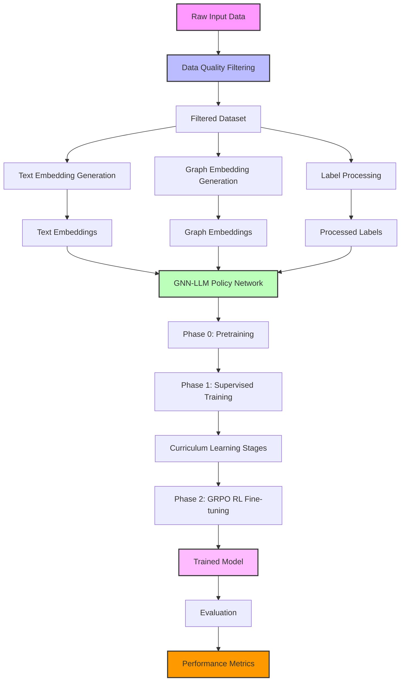
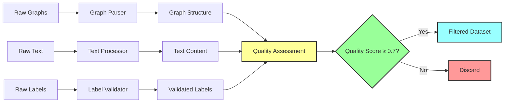
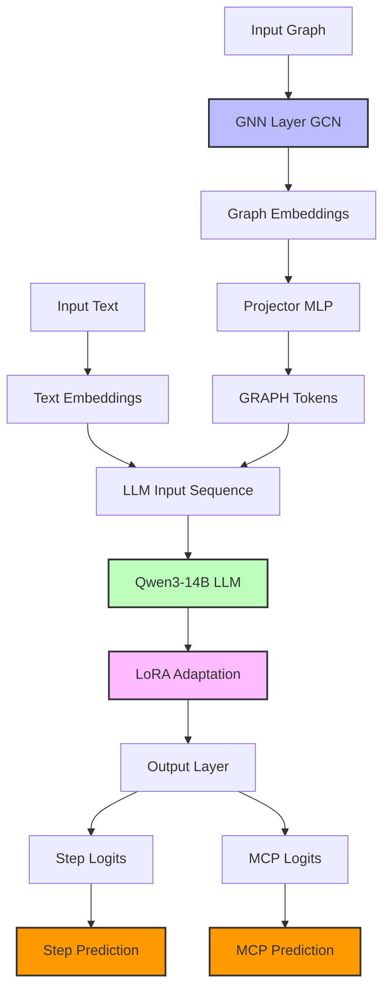
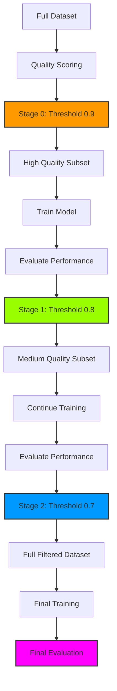
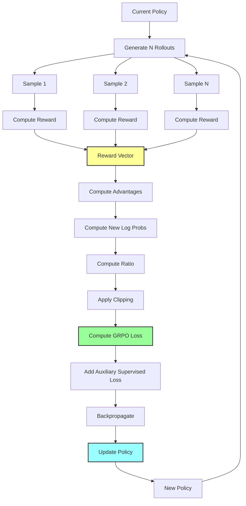
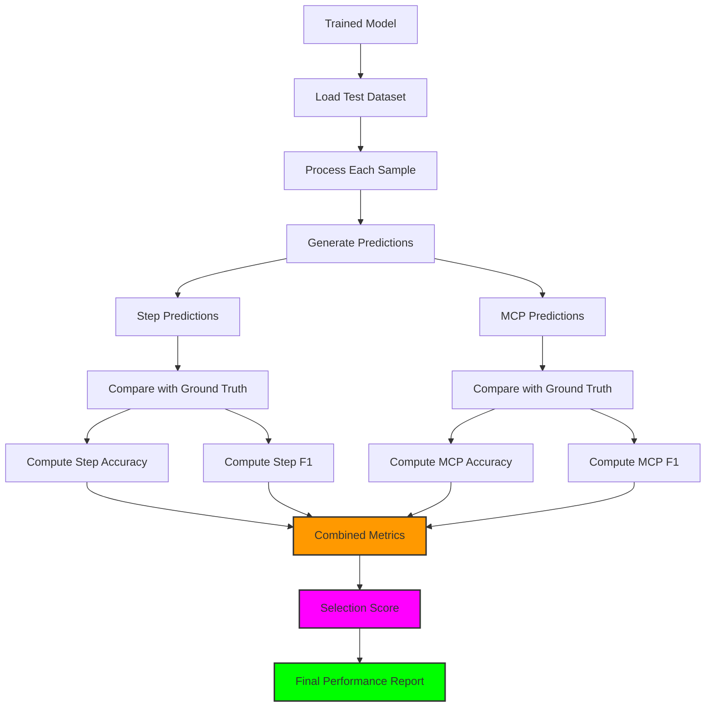
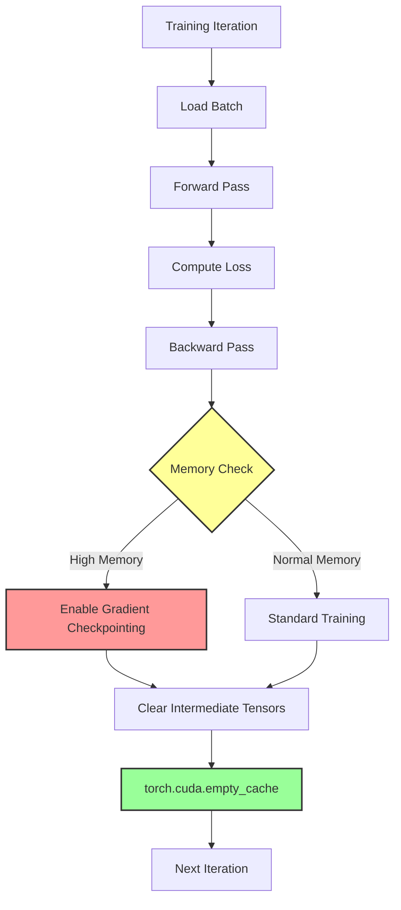
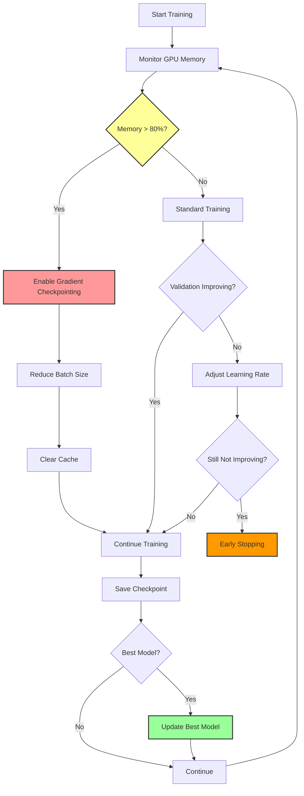
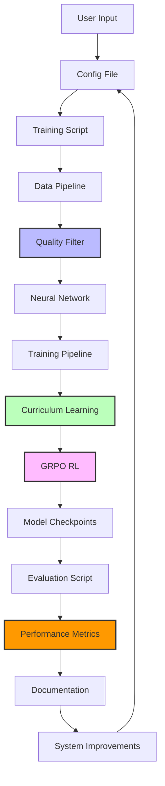

# stepmodel-new System Flow Diagram

## Complete Training and Inference Flow



## Detailed Component Flow

### 1. Data Processing Pipeline



### 2. Neural Network Architecture Flow



### 3. Training Pipeline Flow

```mermaid
graph TD
    A[Start Training] --> B{Phase 0 Checkpoint Exists?}
    B -->|Yes| C[Load Phase 0 Weights]
    B -->|No| D[Skip Phase 0]
    
    C --> E[Phase 1: Supervised Training]
    D --> E
    
    E --> F[Initialize Optimizer]
    F --> G[Curriculum Stage 0]
    G --> H[High Quality Samples Only]
    H --> I[Train Epoch]
    I --> J[Validate Performance]
    J --> K{Stage Complete?}
    K -->|No| I
    K -->|Yes| L[Curriculum Stage 1]
    
    L --> M[Medium Quality Samples]
    M --> N[Train Epoch]
    N --> O[Validate Performance]
    O --> P{Stage Complete?}
    P -->|No| N
    P -->|Yes| Q[Curriculum Stage 2]
    
    Q --> R[All Filtered Samples]
    R --> S[Train Epoch]
    S --> T[Validate Performance]
    T --> U{Stage Complete?}
    U -->|No| S
    U -->|Yes| V[Phase 2: GRPO RL]
    
    V --> W[Generate Rollouts]
    W --> X[Compute Rewards]
    X --> Y[Calculate Advantages]
    Y --> Z[Compute GRPO Loss]
    Z --> AA[Update Policy]
    AA --> AB{Epochs Complete?}
    AB -->|No| W
    AB -->|Yes| AC[Save Best Model]
    
    style E fill:#bbf,stroke:#333,stroke-width:2px
    style V fill:#bfb,stroke:#333,stroke-width:2px
    style AC fill:#fbf,stroke:#333,stroke-width:2px
```



### 4. Curriculum Learning Flow



### 5. GRPO Reinforcement Learning Flow



### 6. Evaluation and Metrics Flow



### 7. Memory Management Flow



## Data Flow Summary

### Input → Output Transformation

1. **Raw Data**: Graph topology + text descriptions + labels
2. **Quality Filter**: Multi-dimensional quality assessment → filtered dataset
3. **Embeddings**: Text → sentence embeddings, Graph → node/edge embeddings
4. **Model Processing**: GNN → graph tokens → LLM → predictions
5. **Training**: Supervised → curriculum → GRPO → trained model
6. **Evaluation**: Predictions → metrics → performance report

### Key Decision Points

1. **Quality Threshold**: Sample inclusion based on quality score ≥ 0.7
2. **Curriculum Stages**: Progressive quality thresholds (0.9 → 0.8 → 0.7)
3. **Training Phases**: Pretraining → Supervised → GRPO
4. **Memory Management**: Dynamic gradient checkpointing based on memory usage
5. **Early Stopping**: Patience-based stopping on validation metrics

## Performance Optimization Flow



## System Integration Flow



## File Structure and Data Flow

```
stepmodel-new/
├── config.json                 # Configuration parameters
├── filter_data_quality.py      # Data quality filtering
├── train_gnn_rl.py            # Main training script
├── evaluate.py                # Evaluation script
├── SYSTEM_DOCUMENTATION.md    # System documentation
├── FLOW_DIAGRAM.md           # This file
├── data/                     # Raw data directory
├── embeddings_data/          # Processed embeddings
│   ├── train/               # Training data
│   ├── val/                 # Validation data
│   └── test/                # Test data
└── checkpoints/             # Model checkpoints
```

## Execution Flow

### Training Execution

1. **Load Configuration**: Read `config.json` parameters
2. **Data Preparation**: Apply quality filtering to dataset
3. **Model Initialization**: Load LLM, initialize GNN and projector
4. **Phase 0** (Optional): Self-supervised pretraining
5. **Phase 1**: Supervised training with curriculum learning
6. **Phase 2**: GRPO reinforcement learning fine-tuning
7. **Checkpoint Saving**: Save best model based on validation metrics
8. **Final Evaluation**: Test on held-out test set

### Inference Execution

1. **Load Model**: Load trained checkpoint
2. **Process Input**: Generate embeddings for input graph and text
3. **Model Forward Pass**: Generate step and MCP predictions
4. **Post-processing**: Apply thresholding and formatting
5. **Output**: Return predicted steps and MCP tools

---

**Document Version**: 1.0  
**Last Updated**: 2025-07-12  
**System**: stepmodel-new  
**Purpose**: System Flow Visualization
