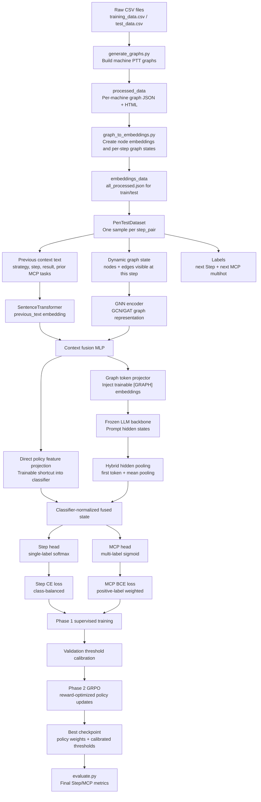

# stepmodel-new System Documentation After Improvements

This document explains the complete `stepmodel-new` system after the latest
improvements. It starts from the raw data and follows the full path through graph
construction, embedding generation, model training, reinforcement learning,
threshold calibration, checkpointing, and final evaluation.

## Goal

`stepmodel-new` predicts two things for each penetration-testing state:

1. The next high-level Step label from the fixed Step ontology.
2. The MCP tool set needed for that next step from the fixed MCP ontology.

The comparison target from `PenStrategist.pdf` is:

| Metric | Target to Beat |
| --- | ---: |
| Step Accuracy | 82.87% |
| Step Micro F1 | 0.80 |
| MCP Accuracy | 48.88% |
| MCP Micro F1 | 0.64 |

The latest changes are designed to raise both Step prediction and MCP micro-F1
by fixing a reinforcement-learning gradient bug, adding a stronger trainable
context path, balancing sparse MCP labels, and calibrating MCP thresholds.

## End-to-End Flow



## Data Pipeline

### 1. Raw Data

The system starts from:

- `stepmodel-new/data/training_data.csv`
- `stepmodel-new/data/test_data.csv`

Each row describes a penetration-testing state, previous actions, previous
results, and the expected next action/tool labels.

### 2. Graph Generation

`generate_graphs.py` converts raw machine traces into graph JSON files under:

- `stepmodel-new/processed_data/train`
- `stepmodel-new/processed_data/test`

Each graph contains nodes representing relevant penetration-testing entities
such as services, files, web pages, findings, commands, credentials, and attack
state. Edges represent relationships between these entities.

### 3. Embedding Generation

`graph_to_embeddings.py` converts processed graph JSON into model-ready files:

- `stepmodel-new/embeddings_data/train/all_processed.json`
- `stepmodel-new/embeddings_data/test/all_processed.json`

For every `step_pair`, it stores:

- the previous context fields,
- the expected next Step label,
- the expected MCP tool list,
- the dynamic graph nodes visible at that step,
- the dynamic graph edges visible at that step,
- SentenceTransformer node embeddings.

This matters because the model should not see future graph state when predicting
the next step.

## Label Space

`label_space.py` defines fixed ontologies.

Step prediction is a single-label classification task over 10 classes.
MCP prediction is a multi-label classification task over 11 tool labels.

The helper functions normalize noisy raw labels with exact matching, prefix
matching, and fuzzy matching. MCP labels are converted into a multihot vector.

## Model Architecture

The main model is `GNNLLMPolicy` in `train_gnn_rl.py`.

### Graph Encoder

The graph encoder can use GCN, GraphSAGE, or GAT. The active `config.json`
now enables GAT:

```json
"gnn_type": "gat",
"use_gat": true
```

GAT is useful here because different graph neighbors should not contribute
equally. For example, an exposed HTTP service and a minor informational node
should have different influence when predicting web enumeration or exploitation.

### Previous-Context Encoder

The previous state text is embedded with `all-MiniLM-L6-v2`. The fields used in
compact prompt mode are:

- previous strategy,
- previous step,
- previous step result,
- previous MCP tasks.

This embedding is projected into the same latent space as the graph embedding.

### Context Fusion

The GNN graph embedding and previous-text embedding are concatenated and passed
through a fusion MLP. This fused vector feeds two paths:

1. Graph-token injection into the frozen LLM.
2. A new direct policy-feature path into the classifier.

### Frozen LLM Path

The fused graph/context vector is projected into several `[GRAPH]` token
embeddings. These replace the first prompt token embeddings before the frozen
LLM forward pass.

The LLM is used as a contextual feature extractor. Its parameters are frozen in
the current training path, so checkpoints store only trainable policy modules.

### New Direct Classifier Path

The latest improvement adds:

- `policy_feature_projection`
- `classifier_norm`

This path sends the fused graph + previous-context representation directly into
the classifier state:

```text
pooled_llm_hidden + projected_policy_features -> LayerNorm -> Step/MCP heads
```

This is important because the old model depended entirely on a frozen LLM hidden
state to preserve the trainable graph signal. The new path gives the classifier a
clean supervised signal from the GNN and prior context, while still retaining
the frozen LLM prompt representation.

## Training Pipeline

### Phase 0: Optional Self-Supervised GNN Pretraining

`pretrain_gnn.py` can train the GNN/projector before supervised learning.

It uses:

- graph contrastive InfoNCE,
- link prediction,
- frozen LLM token-alignment anchors.

If `checkpoints/phase0_gnn_projector.pt` exists, `train_gnn_rl.py` loads it and
uses a drift guard to prevent the GNN from moving too far too quickly.

### Phase 1: Supervised Warmup

The supervised objective is:

```text
total_loss = step_loss_weight * StepCrossEntropy
           + mcp_loss_weight * WeightedMCPBinaryCrossEntropy
           + optional_drift_guard
```

Step labels use class-balanced cross entropy. MCP labels now use positive-label
weights. This is a key improvement because most MCP labels are sparse; without
positive weighting, the model can get high MCP accuracy by predicting too many
negative labels, while micro-F1 stays poor.

New MCP weighting config:

```json
"mcp_class_weighting": true,
"mcp_class_weight_power": 0.5,
"max_mcp_class_weight": 8.0
```

### Phase 2: GRPO Reinforcement Learning

The GRPO phase samples Step and MCP actions from the current policy and scores
them with `classification_reward`.

The latest change fixes a critical bug: the old GRPO loss recomputed logits
inside `torch.no_grad()`, which detached the loss from the policy parameters.
That meant the GRPO objective could not update the model. The fixed version
keeps gradients enabled for the new log-probability computation.

GRPO uses:

- sampled Step action from a categorical distribution,
- sampled MCP multihot action from Bernoulli tool probabilities,
- group-normalized rewards,
- PPO-style clipped ratios,
- auxiliary supervised loss to prevent drift.

## MCP Threshold Calibration

The old system used one global MCP sigmoid threshold, usually 0.5. That is too
coarse for multi-label MCP prediction because each tool has a different base
rate. For example, `Nmap` may appear frequently while `SQLmap` or
`John-the-ripper` may be much rarer.

The improved system calibrates thresholds on the validation set in two ways:

1. It searches a global threshold from 0.10 to 0.90.
2. It searches a separate threshold for each MCP label.

The best threshold strategy is saved in the checkpoint as:

- `mcp_threshold`
- `mcp_thresholds`

`evaluate.py` now reads either a scalar threshold or a per-label threshold list.

## Evaluation

`evaluate.py` loads the best compatible checkpoint and reports:

- Average Reward,
- Step Accuracy,
- Step Micro F1,
- MCP Accuracy,
- MCP Micro F1.

For single-label Step classification, Step Micro F1 equals Step Accuracy. MCP
Accuracy is label-wise binary accuracy across all samples and all MCP labels.
MCP Micro F1 is the global F1 over all MCP true positives, false positives, and
false negatives.

## What Changed in This Improvement Pass

### Code Changes

1. Fixed GRPO gradient flow by removing `torch.no_grad()` from the train-time
   new log-probability path.
2. Added direct graph/context policy features into the classifier.
3. Added classifier normalization after combining LLM hidden state and policy
   features.
4. Added MCP positive-label weighting for sparse multi-label learning.
5. Added per-label MCP threshold calibration.
6. Updated checkpoint metadata to save calibrated MCP thresholds.
7. Updated evaluation to load scalar or per-label MCP thresholds.
8. Switched default graph encoder in `config.json` from GCN to GAT.

### Expected Metric Impact

The changes target the failure modes shown by the previous metrics:

- Low Step Accuracy: improved through the direct context path and stronger GAT
  graph encoding.
- Low Step Micro F1: improved together with Step Accuracy because Step is
  single-label.
- High MCP Accuracy but low MCP Micro F1: improved through positive-label
  weighting and per-label threshold calibration.
- Weak RL improvement: fixed by restoring gradient flow in GRPO.

## Recommended Run Order

From `stepmodel-new`:

```bash
python3 generate_graphs.py
python3 graph_to_embeddings.py
python3 pretrain_gnn.py --config config.json
python3 train_gnn_rl.py --config config.json
python3 evaluate.py
```

If Phase 0 is too expensive or unavailable, the supervised/RL trainer still runs
without the pretraining checkpoint:

```bash
python3 train_gnn_rl.py --config config.json
python3 evaluate.py
```

## Checkpoints

Training writes:

- `checkpoints/best_supervised_checkpoint.pt`
- `checkpoints/best_checkpoint.pt`
- `checkpoints/final_checkpoint.pt`

The evaluator checks for compatible label-head checkpoints in this order:

1. `best_checkpoint.pt`
2. `best_supervised_checkpoint.pt`
3. latest `grpo_checkpoint_epoch_*.pt`
4. latest `supervised_checkpoint_epoch_*.pt`

## Notes on Reproducing the Target Comparison

The repository currently does not contain trained `.pt` checkpoints under
`stepmodel-new/checkpoints`. The code improvements are implemented, but the
final comparison against `PenStrategist.pdf` requires training or restoring a
compatible checkpoint and then running `evaluate.py`.

The current system is now structurally better aligned with the target metrics,
especially MCP Micro F1, because evaluation no longer relies on a single global
threshold and training no longer rewards mostly-negative MCP predictions.
