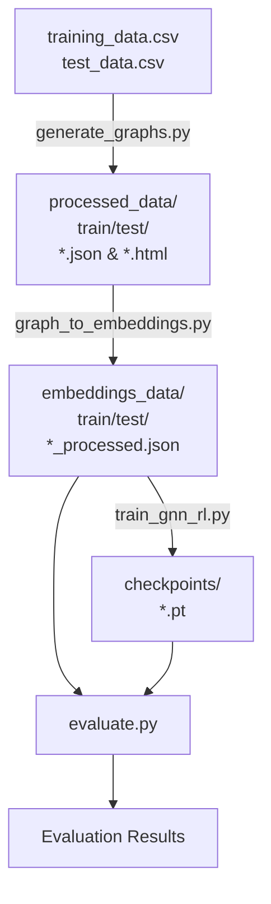
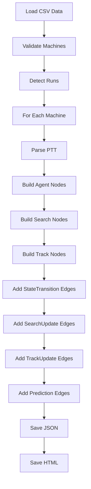

# Research Step Model - Detailed Documentation

This document provides a comprehensive overview of the implementation in the `Research/stepmodel` directory, including step-by-step explanations, data flow diagrams, and examples using the `active_graph.json` dataset.

## Table of Contents
- [Overview](#overview)
- [Directory Structure](#directory-structure)
- [Step 1: Graph Generation](#step-1-graph-generation)
- [Step 2: Graph Embedding](#step-2-graph-embedding)
- [Step 3: Model Training](#step-3-model-training)
- [Step 4: Evaluation](#step-4-evaluation)
- [Example: active_graph.json Walkthrough](#example-active_graphjson-walkthrough)
- [Flow Diagrams](#flow-diagrams)

---

## Overview

The research step model pipeline consists of four main stages:

1. **Graph Generation**: Converts CSV penetration testing data into structured graphs following the same format as `stepmodel/graph_dataset/pentest-dataset`.
2. **Graph Embedding**: Transforms graph nodes and edges into numerical embeddings using sentence-transformers.
3. **Model Training**: Skeleton for a GNN (Graph Neural Network) + RL (Reinforcement Learning, using GRPO) + LLM (Large Language Model) pipeline.
4. **Evaluation**: Skeleton for evaluating the trained model on test data.

---

## Directory Structure

```
Research/stepmodel/
├── data/
│   ├── training_data.csv
│   └── test_data.csv
├── processed_data/
│   ├── train/
│   │   └── [machine_name]/
│   │       ├── [machine_name]_graph.json
│   │       └── [machine_name]_graph.html
│   └── test/
│       └── [machine_name]/
│           ├── [machine_name]_graph.json
│           └── [machine_name]_graph.html
├── embeddings_data/
│   ├── train/
│   │   └── [machine_name]_processed.json
│   └── test/
│       └── [machine_name]_processed.json
├── checkpoints/
│   └── initial_checkpoint.pt
├── generate_graphs.py
├── graph_to_embeddings.py
├── train_gnn_rl.py
├── evaluate.py
├── requirements.txt
├── README.md
└── DOCUMENTATION.md (this file)
```

---

## Step 1: Graph Generation

### Purpose
Converts raw CSV data (`training_data.csv` and `test_data.csv`) into structured graph files (JSON and HTML) with consistent node and edge types.

### Input Data
The CSV files must contain the following columns:
- `Machine`: Name of the penetration testing target machine
- `PTT`: Penetration Testing Tree (step-by-step process)
- `Step_Label`: Label for the current step
- `MCP_Label`: Label for the MCP (Model Context Protocol) task
- `Findings`: Findings from the current step
- `Next_Step_Label`: Label for the next step (for training pairs)

### Graph Structure
The generated graphs follow the same structure as `stepmodel/graph_dataset/pentest-dataset`:

#### Node Types
| Type      | Color      | Description                                                                 |
|-----------|------------|-----------------------------------------------------------------------------|
| Agent     | Blue/Pink  | Represents the cumulative PTT state after each step (Blue = in-progress, Pink = goal) |
| Search    | Orange     | Represents the PTT item being worked on, including MCP task information     |
| Track     | Green      | Represents the findings from executing a Search node                        |

#### Edge Types
| Type            | Color   | Description                                                                 |
|-----------------|---------|-----------------------------------------------------------------------------|
| StateTransition | Black   | Connects Agent nodes, represents progression to the next state             |
| SearchUpdate    | Green   | Connects Agent → Search, represents starting work on a new PTT item        |
| TrackUpdate     | Blue    | Connects Search → Track, represents discovering findings from a Search     |
| Prediction      | Purple  | Connects Track → Agent, represents findings leading to the next state      |

### Code: generate_graphs.py
Key functions in [generate_graphs.py](file:///Users/sagarikachavan/Documents/Research/stepmodel/generate_graphs.py):

- `parse_ptt()`: Parses the PTT field into a hierarchical tree structure
- `phase_title()`: Determines the phase title for a given step number
- `format_tree()`: Formats the PTT tree for display in node titles
- `load_valid_machines()`: Loads and validates machine data from the CSV
- `detect_runs()`: Detects separate penetration testing runs for a machine
- `leaf_new_items()`: Finds new items added between consecutive PTT states
- `build_machine_graph()`: Builds the full graph for a single machine
- `to_dict_json()`: Converts the graph to a JSON dictionary
- `to_html()`: Generates an interactive HTML visualization using Vis.js
- `sanitize_dirname()`: Sanitizes machine names for use as directory names
- `process_csv()`: Processes a single CSV file (train or test)
- `main()`: Main entry point that processes both CSVs

### Usage
```bash
cd /path/to/Research/stepmodel
python generate_graphs.py
```

---

## Step 2: Graph Embedding

### Purpose
Converts the generated graph files into numerical embeddings using sentence-transformers, and extracts step pairs (previous state → next state) for training.

### Embedding Model
Uses `all-MiniLM-L6-v2` from sentence-transformers to embed:
- Node text (title, label)
- Edge text (label, type)

### Output Structure
Each processed machine JSON file contains:
- `machine`: Machine name
- `graph_statistics`: Graph statistics (total nodes, edges, etc.)
- `nodes`: List of nodes with IDs, labels, types, titles, and embeddings
- `edges`: List of edges with "from", "to", labels, types, and embeddings
- `step_pairs`: List of step pairs (previous state → next state) for training

### Code: graph_to_embeddings.py
Key functions in [graph_to_embeddings.py](file:///Users/sagarikachavan/Documents/Research/stepmodel/graph_to_embeddings.py):

- `parse_ptt()`: Parses PTT strings (same as in generate_graphs.py)
- `load_graph_json()`: Loads a graph JSON file
- `get_node_text()`: Extracts text from a node for embedding
- `get_edge_text()`: Extracts text from an edge for embedding
- `embed_texts()`: Embeds a list of texts using sentence-transformers
- `process_machine_graph()`: Processes a single machine's graph and CSV data
- `process_directory()`: Processes all graphs in a directory (train or test)
- `main()`: Main entry point

### Usage
```bash
python graph_to_embeddings.py
```

---

## Step 3: Model Training

### Purpose
Skeleton for training a GNN + RL (GRPO) + LLM model to predict next steps and MCP tasks with explanations.

### Model Architecture
- **GNN**: Simple Graph Neural Network that processes node and edge embeddings
- **Policy Network**: Takes graph embeddings and combines them with step text embeddings
- **LLM**: Uses distilgpt2 to generate predictions (full GRPO integration is a placeholder for future work)

### Reward Function
Based on similarity between predicted and true steps/MCP tasks:
- Step similarity: token overlap score
- MCP similarity: token overlap score
- Total reward = step_reward * 0.5 + mcp_reward * 0.5

### Code: train_gnn_rl.py
Key components in [train_gnn_rl.py](file:///Users/sagarikachavan/Documents/Research/stepmodel/train_gnn_rl.py):

- `SimpleGNN`: Simple GNN model class
- `GNNRLPolicy`: Policy network that combines GNN output with step text embeddings
- `compute_reward()`: Computes reward for a prediction
- `main()`: Main entry point that initializes the model and saves a checkpoint

### Usage
```bash
python train_gnn_rl.py
```

---

## Step 4: Evaluation

### Purpose
Skeleton for evaluating the trained model on test data.

### Evaluation Metrics
- Average reward across all test step pairs (placeholder)
- Individual step and MCP task accuracy (placeholder)

### Code: evaluate.py
Key components in [evaluate.py](file:///Users/sagarikachavan/Documents/Research/stepmodel/evaluate.py):

- Loads the trained model checkpoint
- Processes test data
- Computes and prints average reward (placeholder)

### Usage
```bash
python evaluate.py
```

---

## Example: active_graph.json Walkthrough

Let's walk through the graph structure using [active_graph.json](file:///Users/sagarikachavan/Documents/Research/stepmodel/processed_data/train/active/active_graph.json):

### Graph Statistics
- Total nodes: 35
- Total edges: 45
- Agent nodes: 13
- Search nodes: 11
- Track nodes: 11
- Runs detected: 1
- Rows captured: 11

### Key Nodes
1. **Initial Agent Node**: `agent:active:START` - Blue, start of the pentest
2. **Baseline Recon**: `agent:active:r1_base` - Blue, cumulative PTT after baseline recon
3. **Goal Node**: `agent:active:r1_close` - Pink, task complete (admin access obtained)

### Step-by-Step Example (Step 1.6: SMB Enumeration)
Let's look at the flow for step 1.6:

1. **Agent State**: `agent:active:r1_base` (cumulative PTT up to baseline)
2. **Search Node**: `search:active:r1_s1_1.6` (PTT item 1.6: SMB Enumeration, includes MCP task: "Smb client: Enumerate SMB service to find software versions, hidden directories, and files.")
3. **Track Node**: `track:active:r1_s1_1.6` (Findings: Anonymous login successful, shared resources, etc.)
4. **Next Agent State**: `agent:active:r1_s1_1.6` (cumulative PTT including 1.6)

### Edges for Step 1.6
- `agent:active:r1_base` → `agent:active:r1_s1_1.6`: StateTransition (black)
- `agent:active:r1_base` → `search:active:r1_s1_1.6`: SearchUpdate (green)
- `search:active:r1_s1_1.6` → `track:active:r1_s1_1.6`: TrackUpdate (blue)
- `track:active:r1_s1_1.6` → `agent:active:r1_s1_1.6`: Prediction (purple)

---

## Flow Diagrams

### Overall Pipeline Flow


### Graph Generation Flow


### Single Step Flow in Graph
```mermaid
graph TD
    A[Agent (Previous State)] -->|StateTransition| B[Agent (Next State)]
    A -->|SearchUpdate| C[Search (PTT Item)]
    C -->|TrackUpdate| D[Track (Findings)]
    D -->|Prediction| B
```

---

## Dependencies
All dependencies are listed in [requirements.txt](file:///Users/sagarikachavan/Documents/Research/stepmodel/requirements.txt). Install them with:
```bash
python -m pip install -r requirements.txt
```
