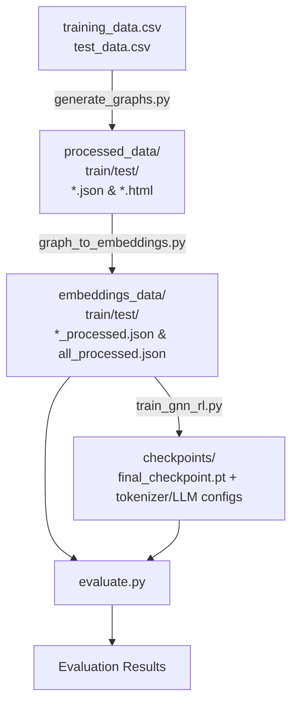

# Research Step Model - Detailed Documentation

This document provides a comprehensive overview of the implementation in the `Research/stepmodel` directory, including step-by-step explanations, data flow diagrams, and examples.

## Table of Contents
- [Overview](#overview)
- [Recent Changes (2026-07-04)](#recent-changes-2026-07-04)
- [Directory Structure](#directory-structure)
- [Step 1: Graph Generation](#step-1-graph-generation)
- [Step 2: Graph Embedding](#step-2-graph-embedding)
- [Step 3: Model Training](#step-3-model-training)
- [Step 4: Evaluation](#step-4-evaluation)
- [Flow Diagrams](#flow-diagrams)

---

## Overview

The research step model pipeline consists of four main stages:

1. **Graph Generation**: Converts CSV penetration testing data into structured graphs following the same format as `stepmodel/graph_dataset/pentest-dataset`.
2. **Graph Embedding**: Transforms graph nodes and edges into numerical embeddings using sentence-transformers.
3. **Model Training**: Trains a GNN (Graph Neural Network using PyTorch Geometric) + LLM (Large Language Model) pipeline using teacher-forcing training.
4. **Evaluation**: Evaluates the trained model on test data, computing rewards based on prediction similarity to ground truth.

---

## Recent Changes (2026-07-04)

### Key Improvements Made:

#### 1. Updated GNN Implementation (`train_gnn_rl.py`)
- Replaced the simple custom GNN with a more robust GNN using **PyTorch Geometric's GCNConv layers**
- Added `GNNModel` class that uses GCNConv and global_mean_pool for graph-level embeddings
- Updated `GNNRLPolicy` with proper forward pass, taking `device` as an argument
- Implemented `PenTestDataset` class that loads and prepares step-pair data with clear prompt/target format
- Added actual training loop with teacher-forcing, AdamW optimizer, and gradient clipping
- Saves `final_checkpoint.pt` instead of `initial_checkpoint.pt`
- Updated deprecated Sentence-Transformers method from `get_sentence_embedding_dimension()` to `get_embedding_dimension()`

#### 2. Updated Evaluation Script (`evaluate.py`)
- Added actual model inference logic that uses trained checkpoints
- Uses the same prompt format as training for consistency
- Uses `compute_reward` function to evaluate prediction quality
- Added `parse_prediction` function to extract strategy/step/MCP from generated text
- Shows sample-by-sample results
- Loads from `final_checkpoint.pt` by default
- Properly sets `llm.eval()` and `policy.eval()` for evaluation

#### 3. Consistency Improvements
- Aligned input/output formats between training and evaluation
- Prepends policy's graph/text combined embedding as a prefix to LLM inputs
- Updated all code to use proper device handling
---

## Directory Structure

```
Research/stepmodel/
├── data/
│   ├── training_data.csv
│   └── test_data.csv
├── processed_data/
│   ├── train/
│   │   └── [machine_name]/
│   │       ├── [machine_name]_graph.json
│   │       └── [machine_name]_graph.html
│   └── test/
│       └── [machine_name]/
│           ├── [machine_name]_graph.json
│           └── [machine_name]_graph.html
├── embeddings_data/
│   ├── train/
│   │   ├── [machine_name]_processed.json
│   │   └── all_processed.json
│   └── test/
│       ├── [machine_name]_processed.json
│       └── all_processed.json
├── checkpoints/
│   ├── final_checkpoint.pt
│   ├── config.json
│   ├── generation_config.json
│   ├── tokenizer.json
│   └── tokenizer_config.json
├── generate_graphs.py
├── graph_to_embeddings.py
├── train_gnn_rl.py
├── evaluate.py
├── requirements.txt
├── README.md
└── DOCUMENTATION.md (this file)
```

---

## Step 1: Graph Generation

### Purpose
Converts raw CSV data (`training_data.csv` and `test_data.csv`) into structured graph files (JSON and HTML) with consistent node and edge types.

### Input Data
The CSV files must contain the following columns:
- `Machine`: Name of the penetration testing target machine
- `PTT`: Penetration Testing Tree (step-by-step process)
- `Step Label`: Label for the current step
- `MCP Label`: Label for the MCP (Model Context Protocol) task
- `Findings`: Findings from the current step
- `Next Step Label`: Label for the next step (for training pairs)
- And more (previous strategy, new strategy, explanations, etc.)

### Graph Structure
The generated graphs follow the same structure as `stepmodel/graph_dataset/pentest-dataset`:

#### Node Types
| Type      | Color      | Description                                                                 |
|-----------|------------|-----------------------------------------------------------------------------|
| Agent     | Blue/Pink  | Represents the cumulative PTT state after each step (Blue = in-progress, Pink = goal) |
| Search    | Orange     | Represents the PTT item being worked on, including MCP task information     |
| Track     | Green      | Represents the findings from executing a Search node                        |

#### Edge Types
| Type            | Color   | Description                                                                 |
|-----------------|---------|-----------------------------------------------------------------------------|
| StateTransition | Black   | Connects Agent nodes, represents progression to the next state             |
| SearchUpdate    | Green   | Connects Agent → Search, represents starting work on a new PTT item        |
| TrackUpdate     | Blue    | Connects Search → Track, represents discovering findings from a Search     |
| Prediction      | Purple  | Connects Track → Agent, represents findings leading to the next state      |

### Code: `generate_graphs.py`
Key functions in [generate_graphs.py](file:///Users/sagarikachavan/Documents/Research/stepmodel/generate_graphs.py):

- `parse_ptt()`: Parses the PTT field into a hierarchical tree structure
- `phase_title()`: Determines the phase title for a given step number
- `format_tree()`: Formats the PTT tree for display in node titles
- `load_valid_machines()`: Loads and validates machine data from the CSV
- `detect_runs()`: Detects separate penetration testing runs for a machine
- `leaf_new_items()`: Finds new items added between consecutive PTT states
- `build_machine_graph()`: Builds the full graph for a single machine
- `to_dict_json()`: Converts the graph to a JSON dictionary
- `to_html()`: Generates an interactive HTML visualization using Vis.js
- `sanitize_dirname()`: Sanitizes machine names for use as directory names
- `process_csv()`: Processes a single CSV file (train or test)
- `main()`: Main entry point that processes both CSVs

### Usage
```bash
cd /path/to/Research/stepmodel
python generate_graphs.py
```

---

## Step 2: Graph Embedding

### Purpose
Converts the generated graph files into numerical embeddings using sentence-transformers, and extracts step pairs (previous state → next state) for training.

### Embedding Model
Uses `all-MiniLM-L6-v2` from sentence-transformers to embed:
- Node text (title, label)
- Edge text (label, type)

### Output Structure
Each processed machine JSON file contains:
- `machine`: Machine name
- `graph_statistics`: Graph statistics (total nodes, edges, etc.)
- `nodes`: List of nodes with IDs, labels, types, titles, and embeddings
- `edges`: List of edges with "from", "to", labels, types, and embeddings
- `step_pairs`: List of step pairs (previous state → next state) for training

### Code: `graph_to_embeddings.py`
Key functions in [graph_to_embeddings.py](file:///Users/sagarikachavan/Documents/Research/stepmodel/graph_to_embeddings.py):

- `parse_ptt()`: Parses PTT strings (same as in generate_graphs.py)
- `load_graph_json()`: Loads a graph JSON file
- `get_node_text()`: Extracts text from a node for embedding
- `get_edge_text()`: Extracts text from an edge for embedding
- `embed_texts()`: Embeds a list of texts using sentence-transformers
- `process_machine_graph()`: Processes a single machine's graph and CSV data
- `process_directory()`: Processes all graphs in a directory (train or test)
- `main()`: Main entry point

### Usage
```bash
python graph_to_embeddings.py
```

---

## Step 3: Model Training

### Purpose
Trains a GNN + LLM model to predict next steps and MCP tasks with explanations.

### Model Architecture

#### 1. GNN Model (`GNNModel`)
Uses PyTorch Geometric's `GCNConv` layers (two layers) with ReLU activations, and `global_mean_pool` to get a graph-level embedding.

#### 2. Policy Network (`GNNRLPolicy`)
Combines graph embeddings (from GNN) + previous step text embeddings (from SentenceTransformer), projects both to same size, then concatenates and projects to LLM hidden size.

#### 3. LLM
Uses `distilgpt2` from HuggingFace Transformers for text generation. The policy output is prepended as an additional embedding to the beginning of the LLM input embeddings to condition generation on the graph context.

### Training Details
- **Teacher Forcing**: Uses teacher forcing for training (feeds ground truth tokens as next inputs)
- **Loss**: Standard language modeling loss on target tokens (ignores loss on prepended policy embedding)
- **Optimizer**: AdamW
- **Gradient Clipping**: Max norm 1.0
- **Checkpoints**: Saves `final_checkpoint.pt`, along with tokenizer and LLM configs

### Code: `train_gnn_rl.py`
Key components in [train_gnn_rl.py](file:///Users/sagarikachavan/Documents/Research/stepmodel/train_gnn_rl.py):

- `set_seed()`: For reproducibility
- `GNNModel`: GCN-based graph neural network using PyTorch Geometric
- `GNNRLPolicy`: Policy network combining graph and text embeddings
- `PenTestDataset`: PyTorch Dataset class that loads step pairs and formats prompts/targets
- `compute_reward()`: Compute reward for a prediction (used in evaluation)
- `main()`: Complete training loop with teacher-forcing

### Usage
```bash
python train_gnn_rl.py
```

---

## Step 4: Evaluation

### Purpose
Evaluates the trained model on test data, computing average reward and showing sample predictions.

### Evaluation Metrics
- **Average reward**: Over all test step pairs, computed using token overlap similarity (0-1)
- **Sample-by-sample results**: Shows true vs predicted step and MCP tasks, along with reward for each sample

### Code: `evaluate.py`
Key components in [evaluate.py](file:///Users/sagarikachavan/Documents/Research/stepmodel/evaluate.py):

- `parse_prediction()`: Extracts strategy, step, MCP tasks from generated text using regex
- Loads trained model checkpoint (`final_checkpoint.pt`)
- Processes test data samples
- Generates predictions using policy and LLM
- Computes and prints individual and average reward

### Usage
```bash
python evaluate.py
```

---

## Flow Diagrams

### Overall Pipeline Flow


### Training Flow (`train_gnn_rl.py`)
```mermaid
graph TD
    A[Step Pair<br>(Previous Context + Next Target)] --> B[GNN]
    A --> C[Sentence Transformer]
    B --> D[GNNRLPolicy]
    C --> D
    D --> E[Policy Embedding]
    F[Prompt Text] --> G[Tokenizer]
    G --> H[LLM Input Embeddings]
    E --> H
    H --> I[LLM]
    I --> J[Generate Target Text<br>(Teacher Forcing)]
    J --> K[Loss Computation]
    K --> L[Update Weights]
```

---

## Dependencies
All dependencies are listed in [requirements.txt](file:///Users/sagarikachavan/Documents/Research/stepmodel/requirements.txt). Install them with:
```bash
python -m pip install -r requirements.txt
```

---
