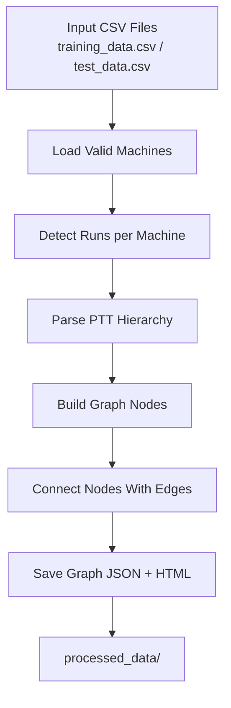
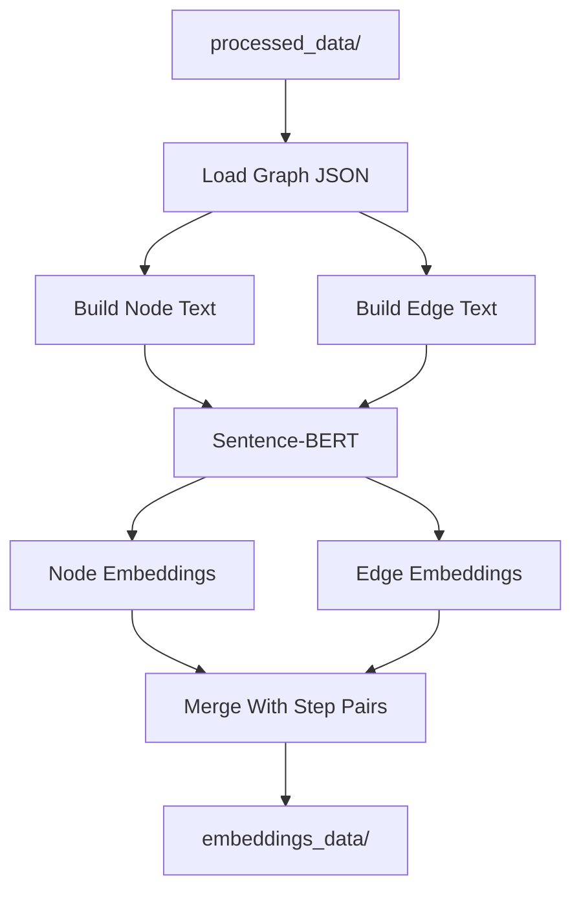
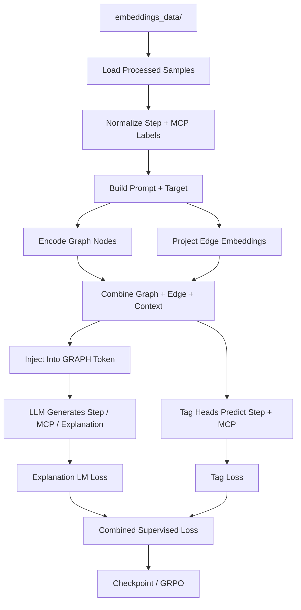
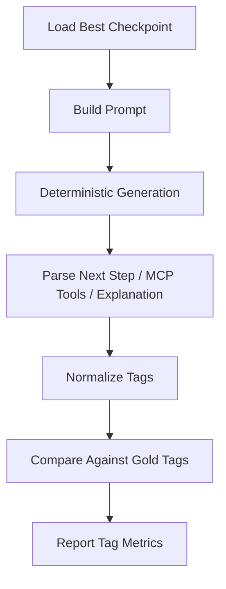

# StepModel Pipeline Documentation

## Overview
This document describes the current StepModel pipeline after the task-alignment update. The system now treats `Next Step` and `MCP Tools` as constrained tags from fixed label lists, while still generating a free-text `Next Step Explanation`.

The current pipeline is:

1. CSV logs -> graph generation
2. Graph JSON -> node and edge embeddings
3. Embedded graph + previous context -> GNN + LLM training
4. Prediction output -> normalized tag evaluation

---

## 1. Current Task Definition

### Input To The Model
Each training sample uses:

- graph node embeddings
- graph edge embeddings
- previous strategy
- previous strategy explanation
- previous step
- previous step explanation

### Output From The Model
Each target uses:

- `Next Step`: one allowed step label
- `MCP Tools`: zero or more allowed MCP labels
- `Next Step Explanation`: generated text

### What Is Evaluated
Evaluation scores only:

- normalized `Next Step`
- normalized `MCP Tools`

The explanation is generated, but it is not part of the accuracy metrics.

---

## 2. Fixed Label Space

The project now uses fixed labels for both tasks.

### Allowed Step Labels

1. `Do a google search for more information`
2. `Enumerate further on the X service to find software versions, hidden directories and file.`
3. `Explore the suspicious files, commands and create a summary of the findings.`
4. `Further Enumerate the website. - hidden directories, links and software`
5. `Enumerate the domain`
6. `Exploit the selected exploitations`
7. `Analyze the outcomes of the previous step and find an attack path`
8. `Ask for human assistant`
9. `Explore the source code for vulnerabilities.`
10. `End task and ask permission to generate the report`

### Allowed MCP Labels

- `Nmap`
- `Metasploit`
- `Netcat`
- `Dirbuster`
- `SQLmap`
- `Smb client`
- `hydra`
- `John-the-ripper`
- `Google search`
- `Interactive CLI`
- `Web page interaction`

### Label Normalization
The training and evaluation code normalize labels before comparison. This reduces failures caused by case changes, whitespace differences, short variations, and near matches.

---

## 3. Input CSV Format

The pipeline starts from `data/training_data.csv` and `data/test_data.csv`.

### Important Columns

| Column | Purpose |
|--------|---------|
| `Machine` | Machine name used to group runs |
| `PTT` | Penetration testing tree text |
| `Previous strategy` | Prior high-level strategy |
| `Previous step` | Prior step taken |
| `Previous step result` | Observed result from prior step |
| `New strategy` | Next strategy in the original data |
| `Strategy explanation` | Why the strategy was selected |
| `New step` | Step label text from the dataset |
| `Step explanation` | Explanation for the step |
| `MCP_tasks` | MCP tools and task descriptions |

### How CSV Fields Are Used Now

- The graph modules still use the CSV as before.
- Training no longer generates `Next Strategy`.
- The new prompt uses:
  - previous strategy
  - previous strategy explanation
  - previous step
  - previous step explanation
- The new target uses:
  - normalized next step label
  - normalized MCP tool set
  - next step explanation

---

## 4. Graph Generation Module

The graph generation stage is unchanged in structure.

### Flow Diagram



### What It Produces

- graph JSON files for training and test machines
- HTML graph visualizations
- node/edge structure that later gets embedded

### Output Location

`processed_data/{train|test}/{machine_name}/`

---

## 5. Graph To Embedding Module

This stage converts graph text into dense vectors using Sentence-BERT.

### Flow Diagram



### Important Change

The previous version already created edge embeddings, but the model did not actually use them.

The current training code now consumes:

- node embeddings through the GNN
- edge embeddings through an edge projection and pooled edge summary

### Output Structure

Each processed machine file contains:

- `nodes` with embeddings
- `edges` with embeddings
- `step_pairs` containing previous and next fields

---

## 6. Training Module

Training still has two phases:

- supervised warmup
- GRPO fine-tuning

But the task objective is now aligned to the label space.

### High-Level Flow



### Current Architecture

#### Graph Encoder
- Node embeddings go through the GNN.
- Edge embeddings are projected separately.
- The edge vectors are mean-pooled into one edge summary vector.

#### Context Encoder
Previous text context is built from:

- previous strategy
- previous strategy explanation
- previous step
- previous step explanation

That context is embedded with Sentence-BERT and projected before being combined with graph information.

#### Combined State
The final state combines:

- graph embedding
- pooled edge embedding
- previous context embedding

This combined vector replaces the `[GRAPH]` token embedding in the LLM input.

#### Output Heads
The model now has two kinds of outputs:

- LLM generation output:
  - `Next Step`
  - `MCP Tools`
  - `Next Step Explanation`
- Auxiliary tag heads:
  - step classification head
  - MCP multi-label classification head

### New Prompt Format

```text
[GRAPH]
### Previous Penetration Testing Context ###
Previous Strategy: ...
Previous Strategy Explanation: ...
Previous Step: ...
Previous Step Explanation: ...

### Predict The Next Action ###
Allowed Next Step Tags: ...
Allowed MCP Tools: ...
Output exactly in this format:
Next Step: <one allowed next step tag>
MCP Tools: <comma-separated allowed MCP tools or None>
Next Step Explanation: <brief explanation>
```

### New Target Format

```text
Next Step: Enumerate the domain
MCP Tools: Nmap, Google search
Next Step Explanation: ...
```

---

## 7. Supervised Training

### What Is Optimized

The supervised phase now uses:

- tag loss for `Next Step`
- tag loss for `MCP Tools`
- auxiliary language-model loss for `Next Step Explanation`

The explanation loss is weighted lower so the model focuses more on correct tags than on long free-text wording.

### Why This Is Better

The old setup trained the model to generate a large free-text block, while evaluation only cared about `Step` and `MCP Tasks`. The current setup matches the training objective to the actual evaluation objective.

---

## 8. GRPO Fine-Tuning

The RL phase still generates multiple rollouts and computes a clipped policy objective, but the reward definition changed.

### New Reward

Reward now focuses only on tags:

- `Next Step` exact normalized match
- `MCP Tools` set quality via F1

### Reward Intuition

```text
Reward = 0.6 * step_tag_correct + 0.4 * mcp_f1
```

This removes the old dependence on free-text token overlap and semantic similarity.

---

## 9. Evaluation Module

Evaluation now measures normalized tags only.

### Flow Diagram



### Important Evaluation Changes

- decoding is deterministic (`do_sample=False`)
- explanation text is ignored for scoring
- labels are normalized before comparison
- MCP is treated as a multi-label set, not a free-text string

### Metrics Reported

| Metric | Meaning |
|--------|---------|
| `Average Reward` | Tag-based reward used by RL |
| `Step Accuracy (Exact Normalized Tag)` | Exact step-label accuracy |
| `MCP Exact-Set Accuracy` | Exact set match for MCP tools |
| `MCP Micro Precision` | Precision across all MCP predictions |
| `MCP Micro Recall` | Recall across all MCP predictions |
| `MCP Micro F1` | Balanced MCP tool quality score |
| `Both Step+MCP Exact Accuracy` | Exact match on both tasks |

---

## 10. Checkpoints And Compatibility

The current architecture changed in important ways:

- edge embeddings are now used
- tag heads were added
- the combined state size changed

Because of that, old checkpoints from the previous free-text setup may not load correctly into the new policy.

### Recommendation

Retrain from scratch after this update before trusting evaluation results.

---

## 11. Key Files

| File | Purpose |
|------|---------|
| `generate_graphs.py` | CSV -> graph JSON and HTML |
| `graph_to_embeddings.py` | graph JSON -> node/edge embeddings + step pairs |
| `train_gnn_rl.py` | label-constrained training + GRPO |
| `evaluate.py` | normalized tag evaluation |
| `config.json` | training and generation configuration |

---

## 12. How To Run

1. Generate graphs:

```bash
python generate_graphs.py
```

2. Generate embeddings:

```bash
python graph_to_embeddings.py
```

3. Retrain the model:

```bash
python train_gnn_rl.py
```

4. Evaluate the new checkpoint:

```bash
python evaluate.py
```

---

## 13. Active Machine Worked Example

This worked example uses:

- `processed_data/train/active/active_graph.json`
- `embeddings_data/train/active_processed.json`

### Stage 1: CSV -> Graph

**Input**

- rows for machine `active` from `data/training_data.csv`
- growing PTT sequence such as:
  - `1.3 Identify Open Ports, Services running on the open ports and their versions`
  - `1.6 SMB Enumeration`
  - `1.7 Replication Share Enumeration`
  - `1.8 Hash Decryption`

**Output**

- graph statistics:
  - total nodes: `35`
  - total edges: `45`
  - agent nodes: `13`
  - search nodes: `11`
  - track nodes: `11`
- example graph nodes:
  - `agent:active:START`
  - `search:active:r1_s1_1.6`
  - `track:active:r1_s1_1.6`

**What the code does**

- builds Agent nodes for cumulative state
- builds Search nodes for the current task plus MCP calls
- builds Track nodes for findings
- links them with StateTransition, SearchUpdate, TrackUpdate, and Prediction edges

### Stage 2: Graph -> Embeddings

**Input**

- `active_graph.json`
- node titles and edge descriptions derived from the graph

**Output**

- `active_processed.json`
- node embeddings
- edge embeddings
- `step_pairs`

Example embedded node:

```text
id: agent:active:START
type: Agent
embedding: [-0.0192, -0.0155, -0.1091, 0.0358, ...]
```

**What the code does**

- embeds node text with Sentence-BERT
- embeds edge text with Sentence-BERT
- merges the graph embeddings with step-pair supervision from consecutive CSV rows

### Stage 3: One Training Sample

Example sample from `active_processed.json`:

**Input context**

- previous strategy: `Enumerate the SMB service in port 445`
- previous step: `Enumerate further on the X service to find software versions, hidden directories and file.`

**Output target**

- next step: `Explore the suspicious files and create a summary of the findings.`
- MCP tools:
  - `Smb client`
  - `Interactive CLI`

**What the code does**

- normalizes the next-step label into the fixed step label set
- normalizes MCP tools into the fixed MCP label set
- builds the prompt and target used by `train_gnn_rl.py`

### Stage 4: Training Internals

**Input to the model**

- node embeddings from the graph
- edge embeddings from the graph
- previous strategy
- previous strategy explanation
- previous step
- previous step explanation

**Output from the model**

- `Next Step`
- `MCP Tools`
- `Next Step Explanation`

**What the code does**

- uses the GNN for node-level graph state
- uses a separate edge projection and mean pooling for edge embeddings
- combines graph state, edge state, and text context
- injects that state into the `[GRAPH]` token embedding
- trains auxiliary tag heads for step and MCP prediction

### Stage 5: Evaluation

**Input**

- prompt built from the same active sample context

**Output**

- normalized next-step prediction
- normalized MCP tool set prediction
- generated explanation text

**What gets scored**

- step exact normalized tag match
- MCP exact-set match
- MCP micro precision / recall / F1

For a visual version of this worked example, open `PIPELINE_FLOW.html`.
